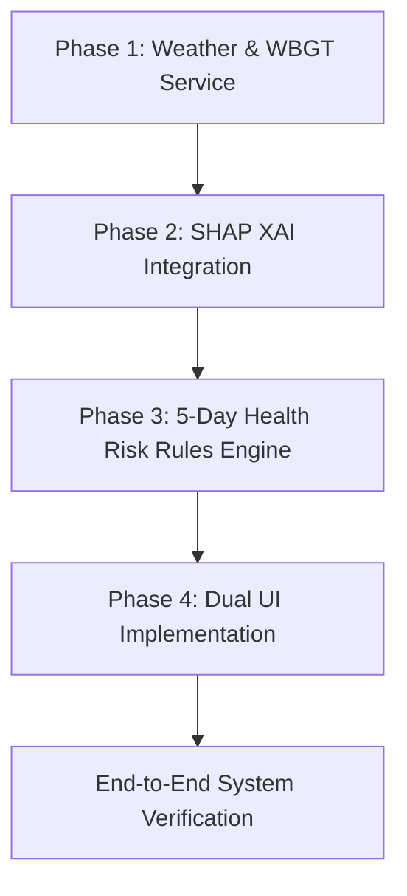

# ThermalGuard (SIH26083) Step-by-Step Implementation Plan

This document establishes the execution blueprint for transforming HeatViz into the award-winning **ThermalGuard Extreme Heatwave Early Warning & Physiological Risk System**.

---

## Architecture Summary & Final Decisions

1. **Phasing:** Vertical slice execution across 4 structured milestones.
2. **Weather & WBGT Service:** Open-Meteo live API integration with 1-hour in-memory cache and local offline fallback dataset for zero-fail demonstrations.
3. **Hyper-local Downscaling:** Settlement macro-WBGT modulated by 50m sector-level AI temperature anomalies ($\Delta T$).
4. **Explainable AI (SHAP):** Precomputed SHAP feature attribution values generated via `shap.TreeExplainer` on Module 1 (XGBoost) and exported into block metadata for zero-latency retrieval.
5. **Predictive Health Risk Engine:** Deterministic rule-based evaluation translating 3–5 day hyper-local WBGT + Demographic Vulnerability into Hospitalization & Mortality Risk Tiers.
6. **Temporal UI:** Day 1–5 temporal scrubber on the map and 5-day trajectory sparklines in the sector inspector.
7. **Dual-Role Frontend:**
   - `/` & `/officer`: Officer Command & Control Dashboard with Zone Planning, Multi-day Scrubber, and SMS dispatch trigger.
   - `/public`: Citizen Heat Portal with simplified warnings, localized advisory, and emergency hydration finder.

---

## Phase 1: Weather Forecast & WBGT Service (`api/weather.py`)

### Objectives
Integrate multi-day weather forecasting and calculate the Wet-Bulb Globe Temperature (WBGT) index.

### Tasks
- [x] **1.1 Create `api/weather.py`**:
  - Implement Australian Bureau of Meteorology / Liljegren simplified WBGT formula:
    $$e = \frac{\text{RH}}{100} \times 6.105 \times \exp\left(\frac{17.27 \times T}{237.7 + T}\right)$$
    $$\text{WBGT} = 0.567 \times T + 0.393 \times e + 3.94$$
  - Integrate Open-Meteo API for coordinates `(-1.317, 36.789)` to retrieve 5-day hourly/daily metrics: $T_{\max}$, $T_{\min}$, Relative Humidity, Wind Speed, Solar Radiation.
  - Implement 1-hour cache layer with fallback to `data/fallback_forecast.json` if network is unavailable.
- [x] **1.2 Create `data/fallback_forecast.json`**:
  - Pre-generate realistic 5-day heatwave scenario data for Kibera (Peak day reaching 34.5°C with 65% humidity).
- [x] **1.3 Add FastAPI Endpoints in `api/main.py`**:
  - `GET /api/forecast/summary`: Returns 5-day daily macro weather + baseline WBGT + settlement advisory.
  - `GET /api/forecast/days`: Returns structured daily timeline for map day-scrubber.

### Verification
- Run `curl http://127.0.0.1:8000/api/forecast/summary` and confirm valid WBGT computation and fallback response when offline.

---

## Phase 2: Explainable AI with SHAP (`scripts/08_compute_shap.py` & API)

### Objectives
Provide mathematical explainability for microclimate drivers using Shapley Additive exPlanations.

### Tasks
- [x] **2.1 Add SHAP Dependency**:
  - Verify and install `shap` in virtual environment.
- [x] **2.2 Create `scripts/08_compute_shap.py`**:
  - Load `models/module1_xgb.json` and 100m/20m feature matrices.
  - Initialize `shap.TreeExplainer(model)`.
  - Compute SHAP values for each of the 18,040 blocks.
  - Extract top positive heat drivers (e.g. `+1.4°C from Metal Roofs (NDBI)`, `+0.9°C from Lack of Tree Canopy (NDVI)`).
  - Save to `data/processed/block_shap_explanations.json`.
- [x] **2.3 Integrate SHAP into `07_score_export.py` & `api/main.py`**:
  - Attach top 3 SHAP quantitative feature contributions directly to block intelligence payload (`/api/blocks/{block_id}`).

### Verification
- Validate that `block_shap_explanations.json` contains attribution values for all blocks summing closely to prediction anomalies.

---

## Phase 3: 5-Day Health Risk Forecasting & Rules Engine (`api/rules.py`)

### Objectives
Translate hyper-local WBGT and demographic vulnerability into actionable health impact risk tiers and dynamic public health advisories.

### Tasks
- [x] **3.1 Upgrade `api/rules.py`**:
  - Implement `evaluate_5day_health_trajectory(block_props, weather_forecast)`:
    - For Day 1 to 5: compute `local_wbgt = day_base_wbgt + (temp_anomaly * 0.4)`.
    - Classify Health Risk Tier:
      - Low: WBGT < 28°C
      - Moderate: WBGT 28–30°C
      - High (Occupational / Elderly Hazard): WBGT 30–32°C
      - Critical (Hospitalization Surge Risk): WBGT > 32°C
    - Modulate tier based on social sensitivity (population density + metal roof concentration).
  - Implement `generate_automated_health_advisory(block_id, local_wbgt, shap_factors)`:
    - Generate human-readable dynamic advisory tailored to public and officers.
- [x] **3.2 Expose Day-by-Day Block Attributes Endpoint**:
  - `GET /api/layers/forecast_day_{day}/attributes`: Returns `{block_id: day_risk_score}` for instant choropleth recoloring across Days 1–5.

### Verification
- Confirm `/api/blocks/{block_id}` returns a complete `forecast_trajectory` array with 5 distinct daily assessments and tailored advisories.

---

## Phase 4: Dual UI (Officer Command Center & Public Portal)

### Objectives
Deliver targeted role-based user experiences for disaster managers and local citizens.

### Tasks
- [x] **4.1 Build Officer Command Center (`web/officer.html` & `web/officer.js`)**:
  - Port core map engine from `web/index.html`.
  - Add **5-Day Heatwave Forecast Scrubber** (Day 1 to 5 buttons/slider) that instantly recolors the 18,040 canvas blocks using `/api/layers/forecast_day_{day}/attributes`.
  - Integrate SHAP feature waterfall breakdown in the sector inspection drawer.
  - Add **Automated Advisory & SMS Dispatch Modal** allowing officers to preview and simulate sending targeted bulk SMS warnings to at-risk sectors.
  - Add Top Header Switcher linking to `/public`.
- [x] **4.2 Build Citizen Public Portal (`web/public.html` & `web/public.js`)**:
  - Clean, accessible, mobile-first interface.
  - "Find My Risk" geolocation button.
  - Plain-language advisory cards: "What this heat means for your body today", "When to stop strenuous work", and "Nearest Cool Spots / Water Points".
  - One-click USSD/SMS alert subscription simulator.
- [x] **4.3 Update FastAPI Route Handlers (`api/main.py`)**:
  - `/` and `/officer` $\rightarrow$ `web/officer.html`.
  - `/public` $\rightarrow$ `web/public.html`.

### Verification
- End-to-end user testing: Smooth switching between Day 1–5 on the map, clicking a sector reveals SHAP explanations and 5-day sparklines, and switching to `/public` gives an intuitive mobile citizen view.

---

## Execution Checklist & Sequence

